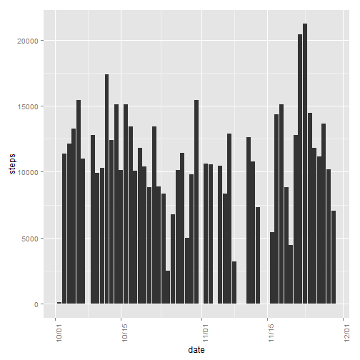
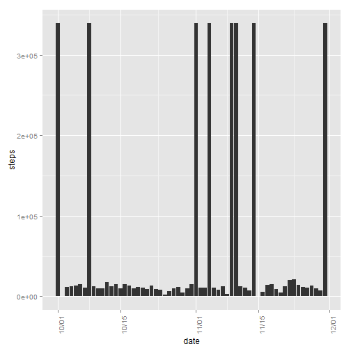
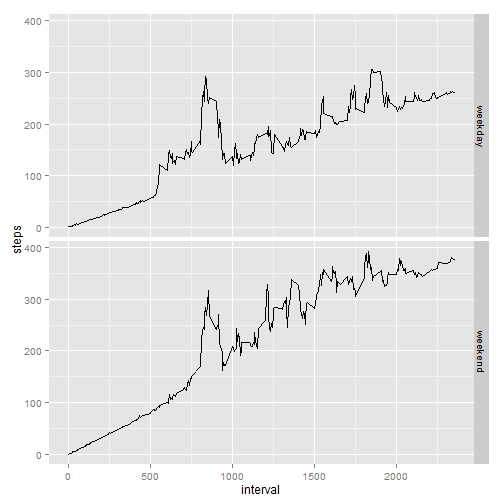

## Transforming input data


```r
Sys.setlocale("LC_TIME", "English")
```

```
## [1] "English_United States.1252"
```

```r
data <- read.csv("activity.csv")
data$date <- as.Date(data$date)
data2 <- aggregate(data$steps,list(data$date),sum)
names(data2) <- c("date","steps")
```
  
  
# Plotting histogram

```r
library(ggplot2)
library(scales)
g <- ggplot(data2,aes(x=date,y=steps))+geom_bar(stat='identity')
g + scale_x_date(labels = date_format("%m/%d")) + theme(axis.text.x = element_text(angle=90))
```

```
## Warning in loop_apply(n, do.ply): Removed 8 rows containing missing values
## (position_stack).
```

 
  
  
# Calculating mean and median

```r
mean(data2$steps, na.rm=TRUE)
```

```
## [1] 10766.19
```

```r
median(data2$steps, na.rm=TRUE)
```

```
## [1] 10765
```
    

# Generating time series plot

```r
library(plyr)
data3 <- ddply(data,.(interval),summarize,steps=mean(steps, na.rm=TRUE))
ggplot(data3, aes(x=interval,y=steps)) + geom_line()
```

 

# Interval with max number of steps

```r
data3[data3$steps==max(data3$steps),]
```

```
##     interval    steps
## 104      835 206.1698
```

# Populating missing values

```r
sum(is.na(data$steps))
```

```
## [1] 2304
```

```r
data4 <- data
for (i in 1:nrow(data)){ 
    if(is.na(data[i,1])){ 
        data4[i,1] <- data3[data3$interval==data4[i,3],1]
    } 
}
```

# Histograms after filling in missing values

```r
data5 <- aggregate(data4$steps,list(data$date),sum)
names(data5) <- c("date","steps")
g <- ggplot(data5,aes(x=date,y=steps))+geom_bar(stat='identity')
g + scale_x_date(labels = date_format("%m/%d")) + theme(axis.text.x = element_text(angle=90))
```

 

# Mean and median after filling in missing values

```r
mean(data4$steps)
```

```
## [1] 186.9062
```

```r
median(data4$steps)
```

```
## [1] 0
```

# Plot for weekend vs weekday

```r
data4$weekday <- factor(ifelse(weekdays(data4$date) %in% c('Friday','Saturday','Sunday'),"weekend","weekday"))
data6 <- ddply(data4,.(weekday,interval),summarize,steps=mean(steps, na.rm=TRUE))
ggplot(data6, aes(x=interval,y=steps)) + facet_grid(weekday ~ .)+geom_line()
```

 

